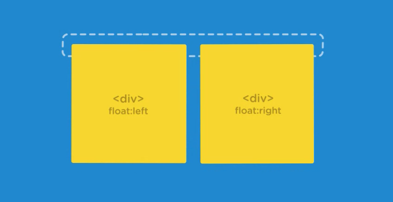

# CSS Layout Basics

### Positioning
---

#### Inline Display
* There are block level elements and inline level elements
    * Block Elements:
        * h tags
        * p tags
        * divs
    * Inline Elements:
        * imgs
        * a tags
        * spans
* Inline elements naturally flow next to eachother
* Inline elements do not take in vertical margin and padding values, on horizontal
* Inline-block lets you style an inline element as you would a block element while keeping it in the same line as the elements next to it

#### Remove Spaces Between Inline or Inline Block Elements
* The spaces between the elements results from the literal spaces in the markup
* You can put the opening and closing <li> tags on the same line but this is not recommended
* Add a negative margin, this will remove the default white space
    * Note that element font size will affect how much negative margin you will need to apply
```css
.main-nav li {
    margin-right: -4px;
}
```

#### Floats
* Similar to inline, but floated elements are taken out of the normal document flow
    * Other content will flow around them

* Be default, browsers display elements in the order they appear in the HTML source code. This is called Normal Document Flow
    * These elements are either block or inline
    * They appear stacked or inline with eachother
* When an element has a flow property it is taken out of this normal flow and shifted to the left or right side of it's container
* Any content next to the float will flow, or wrap, around it's left or right side
* Floated elements are technically block level elements since it accepts any width, height, padding, or margin values but it behaves like an inline element b/c it doesn't exist on a line of it's own
* You don't have to worry about the whitespace in the markup for floats
    * Floated elements will sit adjacent to eachother regardless of the html whitespace between them
* Parent block level elements that contain floated elements will have their height collapse

* If parent has no padding or margin then it's height will collapse to 0
* A parent container with floated elements may not always collapse to no height at all; if the container includes a padding or height value, it'll have some visible height.
* There are multiple ways to solve the collapsing height issue
    * Set a fixed height
        * This is the least suitable method as it will not be flexible for other screen sizes / devices
    * Overflow
        * hidden or auto
            * This can work as long as there is not content that will go below the parent element as that content would not be displayed, and would appear to be cutoff
    * Clearfix
        * A clearfix fixes the collapsing issue by forcing a container to expand and contain the floated elements.
```css
.clearfix::after {
    content: ""; /* This generates a blank psuedo-element at the bottom of the parent container */
    display: table; /* Display the psuedo-element as a block level table element */
    clear: both; /* Clears any collapsed space created by floats on either side */
}

/* Alternative from MDN */
/* the after psuedo-element is the last
    child of the selected element. It is
    inline by default
*/
.container::after {
    content: "";
    display: block;
    clear: both;
}
```
* Use inline-block when you need more control over the center and vertical alignment of your elements
* Also use inline-block to lay out navigation items side by side or create simple two-column layouts
* Use floats when you need content to go along the left or right side of an element
* Floats do not need to deal with the default whitespace, but they do need to take collapsing parent element height into account
    * Solve collapsing parent height issues with a clearfix